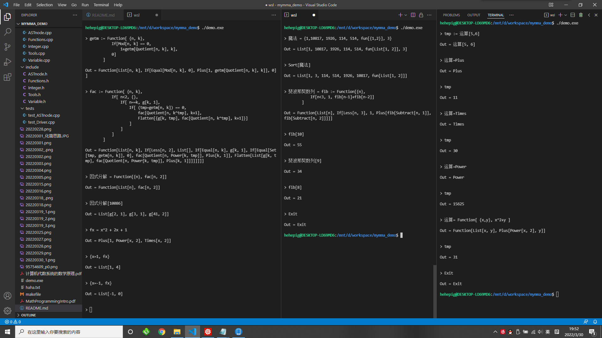
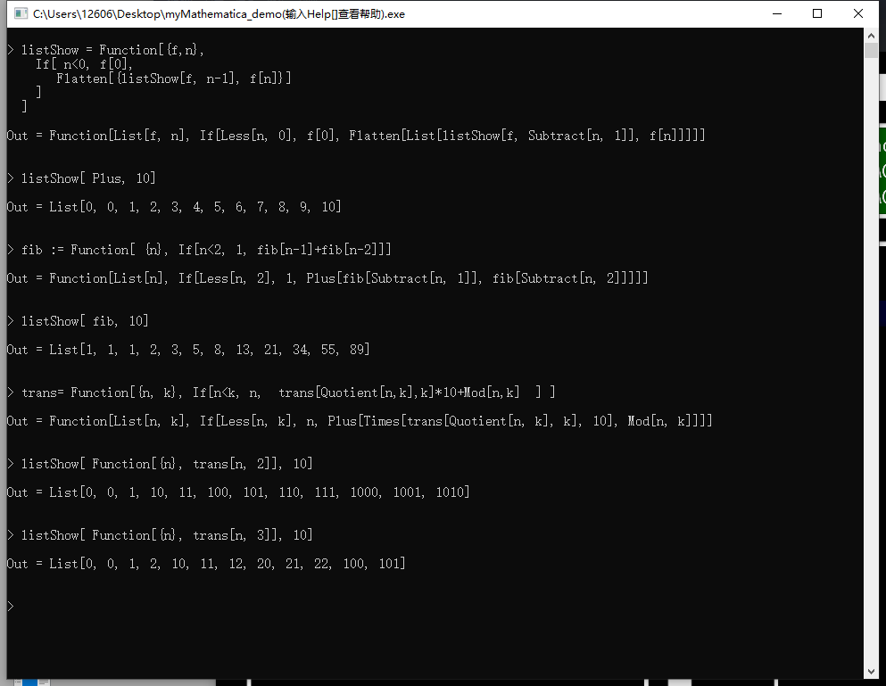

# My Mathematica

# 0. 参考资料
计算机代数系统的数学原理
Mathematica programming: an advanced introduction -Leonid Shifrin
https://reference.wolfram.com/language/guide/Syntax.html
https://www.wolfram.com/language/fast-introduction-for-math-students/en/

# 1. 理念

## 1.1 符号计算

* 一切皆可看作符号。

* 由符号组成的表达式，仍然是一个符号。

* 用树形结构来表示符号。（`FullForm` 或 `TreeForm` 来查看结构）

    在 mathematica 中可以使用 FullForm 或 TreeForm 函数来查看表达式结构
    ```
    In := FullForm[a+b/(c+1/d)]
    Out//FullForm = Plus[a, Times[b, Power[Plus[c, Power[d, -1]], -1]]]
    ```

* 基本元素：Number(Integer, Rational, Real, Complex), String, Symbol, 

    这里的 Symbol 指表达式之外的

    在 mathematica 中，可以使用 Head 来查看元素或表达式的头
    ```
    In := {Head[1], Head[1.5], Head["123"], Head[a], Head[True], Head[a+b]}
    Out = {Integer, Real, String, Symbol, Symbol, Plus}
    ```

* 函数的符号。

    函数也是一个符号，它的头是其运算完后最外层的值的头。（我先这么认为吧，如果以后遇到更好的想法再改）

    可以看到，返回值是 Null 的函数，其返回值 Null 也是个符号。
    ```
    In := {# // Head, # // FullForm} &@Do[Print[i], {i, 1, 2}]
    1
    2
    Out = {Symbol, Null}

    In := {# // Head, # // FullForm} &@Do[Print[i], {i, 1, 2}] //FullForm
    1
    2
    Out//FullForm= List[Symbol, FullForm[Null]]

    ```


## 1.2 函数式编程

* 用函数描述来达到编程的目的

    在 mathematica 中，几乎所有操作都是函数，包括最基础的加减乘除等运算。
    可以利用 `FullForm` 或 `TreeForm` 来查看表达式的函数表达方式。
    ```
    In := FullForm[a+b/(c+1/d)]
    Out//FullForm = Plus[a, Times[b, Power[Plus[c, Power[d, -1]], -1]]]
    ```

    在 mathematica 中，似乎复数也是通过使用函数作用于基本元素来实现的。
    不过复数应该是有其特有的类型，可以用 NumberQ 来检验。
    ```
    In := Head[Sqrt[-1]]
    Out = Complex

    In := FullForm[Sqrt[-1]]
    Out//FullForm = Complex[0, 1]

    In := FullForm[Sqrt[-3]]
    Out//FullForm = Times[Complex[0, 1], Power[3, Rational[1, 2]]]

    In := {NumberQ[Sqrt[-1]], NumberQ[Sqrt[-3]]}
    Out = {True, False}

    ```

* 分支、循环

    在 mathematica 中，有许多方式来实现分支、循环，而且都是函数式的。
    ```
    In := If[2>1, a, b]
    Out = a

    In := Do[Print[i, " is a prime number"], {i, {2, 3, 5, 7, 11}}]
    2 is a prime number
    3 is a prime number
    5 is a prime number
    7 is a prime number
    11 is a prime number
    
    In := Apply[Plus, Table[n, {n, 1, 100, 2}]]
    Out = 2500
    ```

* 匿名函数

    在 mathematica 中，可以利用匿名函数来达到自定义函数的目的。
    具体操作可以使用 `#`、`&` 配合 `@`，或者直接用函数 `Function`。
    ```
    In := #^2 & @ (x+1)
    Out = (1+x)^2

    In := #1+#2 & [a,b]
    Out = a+b

    In := Function[a, a^2][x+1]
    Out = (x+1)^2

    In := Function[{a,b}, a+b][x+y, z^2]
    Out = x+y+z^2
    ```

* 对象

    mathematica 仍然支持对对象的操作。
    它使用的是是弱类型语言，或者从感官上来说，它只有一种类型：符号。
    赋值有两种赋值方式，立即赋值 `=` 和延时赋值 `:=`。

* 命名规则

    内建符号都是用大骆驼命名法（Camel），如 `EvenQ`, `FactorInteger`, `E`, `Pi`, `Plus` 等。
    为了不引起歧义或冲突，希望用户自定义符号采用小骆驼命名法（camel），如 `a`, `b`, `c`, `myNumber`, `firstWordInTheSentence` 等。

## 1.3 解释性语言
* 输入一行或一段代码，立即运算并处理出答案输出。
* 用户自定义变量均为全局变量，在每次输入中共享。退出程序后变量消失。


# 2. 函数表

* 说明
    * Flat：代表该函数支持任意数量参数。
    * Orderless：代表该函数具有交换性，任意交换参数顺序，结果不变。
    * Only[x,y]：代表该函数只支持特定数量参数，中括号内为支持的数量列表
    * 代码示例：函数下方有代码示例，涵盖（已实现或计划实现了的）该函数的各种用法。

* AtomQ
    * Only[1]
    * 返回是否是基本元素

* FullForm

    * Only[1]
    * 打印表达式完整形式
    * 可用于隔离

* Head

    * Only[1]
    * 打印表达式的头

* Set

    * Only[2]
    * 立即赋值
    ```
    Set[a, expr]
    a = expr
    ```

* SetDelayed

    * Only[2]
    * 延时赋值
    ```
    SetDelayed[a, expr]
    a := expr
    ```

* Plus

    * Flat
    * Orderless
    * 加法。代表其参数之和。
    * 有效的情况只有两个或以上参数时。
    ```
    Plus[]
        <=> 1
    Plus[a]
        <=> a
    Plus[a,b]
    Plus[a,b,c,d]
    a+b
    ```

* Times

    * Flat
    * Orderless
    * 乘法。代表其参数之积
    * 有效的情况只有两个或以上参数时。
    ```
    Times[]
        <=> 1
    Times[a]
        <=> a
    Times[a, b]
    Times[a, b, c, d]
    a*b
    ```

* Power

    * Only[0, 1, 2]
    * 幂运算。`Power[a, b]` 代表 `a^b`
    * 实际上有用的只有两参的情况
    * 注意，事实上 mathematica 的 `Power` 函数支持多参，具体意义可以看官方文档。不过我的实现中先只支持两个或以下的参数。
    * 当两个参数均为
    ```
    Power[]
        <=> 1
    Power[a]
        <=> a
    Power[a,b]
    a^b
    ```

* Subtract

    * Only[2]
    * 减法。`Power[a, b]` 代表 `a-b`
    * 需要注意的是，接收到用户输入的 `Subtract` 函数后，我的实现中会将其转化为 `Times` 和 `Plus` 的组合。即（我猜的，不过我准备这样实现），内部运算中，不存在 `Subtract` 函数。这点可以在 `mathematica` 中用 `FullForm` 查看。
    ```
    Subtract[a, b]
        <=> Plus[a, Times[-1, b]]
    a-b
    ```


* Divide

    * Only[2]
    * 除法。`Divide[a, b]` 代表 `a/b`
    ```
    Divide[a,b]
    a/b
    ```

* Rational

    * Only[2]
    * 参数只能是 Integer 类型。
    * 有理数。第一个参数为分子，第二个参数为分母。
    * 在 mathematica 中，输入 `Rational[1,1.5]*1.5` 、`Rational[a,b]*b`、`Rational[1,Sqrt[3]]*Sqrt[3]` 会发现它都是原样输出。只有输入类似 `Rational[4,5]*5` 这样参数全是整数时才会进行运算。我猜前面哪几种是因为参数不是整数，不匹配，所以把它当未知函数来处理。
    * 若是要对符号进行除法运算，可以用 Divide，或是用`Times`与`Power`组合，这也是程序最后整理成的形式。可以在 mathematica 中尝试 `Divide @@ Rational[a, b]*b`，将 Rational 的头换成 Divide，就会出现化简后的答案 `a` 了。
    * 为了不出错，用户输入尽量不要用该函数，请使用`Divide`。
    ```
    Rational[2,3]
    ```

* Complex

    * Only[2]
    * 参数只能是 Integer 或 Real 类型

* Function
    * 用于自定义函数
    * `Function[List[xxx], expr]`，代表该函数的参数表为 `List`，表达式为 `expr`。
    * 要求参数表内均为若干单纯的变量名，且 Function 只存在两个儿子。若不满足，则当暂置。
    * mathematica 中设计函数东西太多了，弄不过来，先弄个弱小版的吧。
    * 变量表若与全局变量有冲突，则全局变量在 expr 中不可见。
    ```
    Function[List[x,y], Plus[x,Times[y, y, y]]]
    ```

* Apply
    * 用于改变头部
    * `Apply[fun, expr]`，代表用 fun 代替 List 语法树的头。
    * `Apply[PureFunction, List]`，代表用 List 作为 PureFunction 的参数，返回算出的值。
    * mathematica 中这个也有好多东西，也先弄个弱小版的。
    * 20220331: 意识到这应该不太对……函数的调用因该用rules或者类似ReplaceAll这种来实现
    ```
    Apply[Plus, f[a, b]]
        => Plus[a, b]
    
    Apply[Function[List[x,y], Plus[x, Times[y,y,y]]], Plus[a,b]]
        => Plus[a, Times[b,b,b]]
    ```

* If
    * 判断
    * `If[expr0, expr1, expr2]`，代表判断 expr0 的值。若为True，则返回 expr1 的值；若为False，则返回 expr2 的值；都不是则保留原样。
    * Only[3]
    * 开始摆烂了，只能先做超级弱小版的 mathematica 了，很多更多的语法先不支持了。
    * mathematica 里面数字不能当布尔值，只有 True 或者 False 是有效的。
    ```
    If[True, a, b]
        => a
    If[False, a, b]
        => b
    If[Equal[1, 1], a, b]
        => a
    If[Equal[1, 0], a, b]
        => b
    ```

* Quotient
    * 商
    * `Quotient[m, n]`，代表 the integer quotient of m and n.
    ```
    Quotient[5,2]
    ``` 

* Mod
    * 取模
    * `Mod[m, n]`
    ```
    Mod[8, 3]
    ```

* Equal
    * 判断是否相等
    * `Equal[expr1, expr2]`
    ```
    Equal[1, 1]
        => True

    Equal[1, 0]
        => False

    Equal[a, b]
        => Equal[a, b]
    
    Equal[a, 1]
        => Equal[a, 1]
    
    Set[a, 1]; Equal[a, 1]
        => True

    Equal[Plus[a, a], Times[2, a]]
        => True

    Equal[1, 1, 1, 1]
        => True

    Equal[1, 1, 0, 1]
        => False

    Equal[1, 1, 1, a]
        => Equal[1, 1, 1, a]
    
    Set[a, 1]; Equal[1, 1, 1, a]
        => True
    ```

* Greater/Less
    * 大于/小于
    * `Greater[expr1, expr2, ...]`
    * `Less[expr1, expr2, ...]`
    * 返回 True、False、或保留原样（若不可比）
    * 若不足两项，则为 True
    ```
    Less[1,2]
    Greater[5,4,3,2,1]
    Greater[5,4,3,5,1]
    ```

* Flatten
    * 展开
    * `Flatten[List]`，将List完全展开
    * 说明：这只是 mathematica Flatten 的一部分
    ```
    Flatten[List[List[1], b, List[2,3,4], 6]]
        => List[1, b, 2, 3, 4, 6]
    
    Flatten[List[List[]]]
        => List[]
    ```

* Sort
    * 排序
    * `Sort[List]`，排序List中的内容
    * `Sort[List, func]`，sorts using the ordering function p. 
    * 注意，其实不一定是List，任何头都可以。
    ```
    Sort[List[1, 5, 2, 4]]
    Sort[List[a, b, fun[d, e], fun[a, b], x, 1, 2]]
    Sort[List[fun[2, 4], Times[a, d, b, 7], fun[1, 2], 7, a, 1, 2, b, a]]

    Sort[List[1, 5, 2, 4], Greater]
        => List[5, 4, 2, 1]
    
    Sort[a[1, 5, 3]]
        => a[1, 3, 5]
    
    Sort[{4, 3, 1, 7, 9}, # > 3 &]
        => {4, 7, 9, 1, 3}
    ```

* Rule
    * 代表一个替换规则，单独存在时似乎没有意义，需要和其他函数配合使用。
    * `Rule[LHS, RHS]`，代表将 LHS 替换为 RHS
    * 两边都会先运算一遍
    * `LHS -> RHS`
    ```
    Rule[a, b]
        => Rule[a, b]
    a=10; b=15
    Rule[a, b]
        => Rule[10, 15]
    Rule[a+b, c]
        => Rula[15, c]
    ```

* RuleDelayed
    * 类似Rule，但两边不运算先。
    * `LHS :> RHS`
    ```
    Rule[a, b]
        => Rule[a, b]
    a=10; b=15
    Rule[a, b]
        => Rule[a, b]
    Rule[a+b, c]
        => Rula[a+b, c]
    ```

* Replace
    * applies a rule or list of rules in an attempt to transform the entire expression expr. 
    * `Replace[expr, rules]`
    * 只判断整个表达式
    ```
    Replace[a+b, a+b->c]
        => c
    Replace[a+b+c, a+b->d]
        => a+b+c
    ```

* ReplaceAll
    * applies a rule or list of rules in an attempt to transform each subpart of an expression expr. 
    * `ReplaceAll[expr, rules]`
    * `expr /. rules`
    * 注意这个只会替换一次，先查找，再把要替换的替换掉，若有冲突，在前面的优先
    ```
    ReplaceAll[a+b+c, a+c->d]
        => b+d

    ReplaceAll[a + b + c, {a + c -> d, a -> x}]
        => b+d
    
    {a, b, c} /. List -> f
        => f[a,b,c]
    
    ReplaceAll[a + b + c, {a :> x, a :> c -> d}]
        => b+c+x
    
    ReplaceAll[a + b + c, {a -> x, a + c -> d}]
        => b+d
    ```

* ReplaceRepeated
    * repeatedly performs replacements until expr no longer changes. 
    * `ReplaceRepeated[expr, rules]`
    * `expr //. rules`
    * 相当于多次调用 ReplaceAll 直到不变。注意可能会死循环

* Exit[]
    * 退出


# 3. 实现细节

* 20220301
    * 所有操作都先是形式上对 ASTnode* 进行，也就是操作该语法树的节点
    * 统一由函数 ASTnode *Compute(ASTnode *) 来进行语法树的计算。
        * 在该函数中，先是递归计算当前节点的子节点代表的子树们，再根据当前节点的 NodeInfo 调用相应的函数进行计算。
        * 计算完毕之后，原先语法树会被替换为结果语法树，旧节点连同其空间会被释放（除非它被复用挂在新的语法树上）。
* 20220302
    * 关于 Set 与 SetDelayed 的规则：
        * 执行 `Set[varName, expr]` 时，先调用 Compute 将 expr 树化简（若是 SetDelayed 则不化减），树中无法化简的变量将保留。再将化简结果 Duplicate 到变量表里面。
        * 在以后要用到 varName 变量的时候，用 Duplicate 复制一份出来再对复制出来的那份现场化简（因为有可能那里面的一些变量被赋值了）。
* 20220305
    * 关于 Apply：
        由于之前封好了 VariableTable 类，查询、修改全局变量表很方便。
        于是，Apply就分成了几步：
        * 保存变量信息
        * 修改变量表
        * 计算并保存答案（由于符号计算的特性，这时只需要Compute一下Function的expr即可）
        * 恢复变量信息

* 20220328
    * 关于 Power：
        部分参考了 mathematica 的文档
        * `(a b)^c` is automatically converted to `a^c b^c` only if c is an integer. 
        * `(a^b)^c` is automatically converted to `a^(b c)` only if c is an integer. 
        * `Power[x,y,z,...]]` is taken to be `Power[x,Power[y,z,...]]]`.
        * `X^0` = 1
        * `X^1` = X
        * Integer ^ Integer ，则直接算

* 20220329
    * 关于 Times 与 Power：
        为了处理 `Times[a, Power[a, -1]]` 的情况，在 Times 里，先默认都给东西加上 Power[#,1]，再合并同类项

* 20220331
    * 关于 Rules：
        初步准备用一个数据结构来代表一个 Rule 或一组 List。（类似 Map 那样）


# 999. 日志
|编号|日期|涉及文件|说明|
|--|--|--|--|
||20220224|README.md|开始，先写文档|
||20220228|ASTnode.h ASTnode.cpp <br> Functions.h Functions.cpp <br> Integer.h Integer.cpp|ASTnode 结构体以及一些基本操作<br> AtomQ <br> FullForm <br> 弱小版的整型（用于测试）|
||20220301|ASTnode.h ASTnode.cpp<br>Functions.h Functions.cpp|修改了 CreateASTnode，使其调用时必须指明 preNode 和 nxtNode <br> Compute|
||20220302|ASTnode.h ASTnode.cpp<br>Functions.h Functions.cpp<br>Variable.h Variable.cpp|ASTnode* Duplicate(xxx)<br>Set<br>VariableTable<br>具有变量表了，可以利用Set进行变量赋值了，而且更新了一下测试driver，使其可以识别几乎任意支持变量的纯函数表达式了|
||20220303|test_ASTnode.cpp<br>ASTnode.h ASTnode.cpp <br> Functions.h Functions.cpp|Plus 的结合性 <br>SetDelayed<br> **!!重要!!发现Destroy有内存泄漏bug，改好了，并在测试中加了几个用于测试内存的小工具函数**|
||20220304|ASTnode.h ASTnode.cpp<br>Functions.h Functions.cpp<br>Variable.h Variable.cpp|改了ASTnode的定义，变成带头尾节点的双向链表，这样各种操作可以更简洁<br>发现使用变量名计算时会造成内存泄露，修复了（错在Compute函数中对Var的计算忘记Destroy(node)了）<br>Plus 对整数的合并<br>Times的结合性、对整数的合并|
||20220305|Functions.h Functions.cpp|Function, Apply，实现了自定义函数|
||20220315|ASTnode.h ASTnode.cpp <br> Functions.h Functions.cpp|发现Compute那里对于左右节点的右左节点没修改好，可能导致指针错误丢内存，改了，目前没发现问题了 <br> If 语句 <br> 为 ASTnode 的 Unmount 函数添加了必须指明的 preNode_ 和 nxtNode_ 参数，也是为了时刻提醒别丢内存 <br> 还发现了Apply函数那里，临时map里面应该复制一份而不是把全局函数表的地址存着，因为可能在递归的时候全局函数表的地址被覆盖、释放了 <br> 为了做斐波那契数列的函数，在简陋词法分析里面加入了识别负整数|
||20220316|Functions.h Functions.cpp|调整了一下Compute，使自定义函数能直接 f[] 这样调用，不需要再手动 Apply 了 <br> 发现现在我这个函数递归用的栈空间，导致递归层数不能太多，不过mma好像递归层数也是限制在了1024，最终还是要在恒等优化上下功夫|
||20220318|Functions.cpp Functions.h <br> Integer.h|Quotient, Mod|
||20220319|Functions.cpp Functions.h <br> ASTnode.cpp|Flatten<br>在测试 `Flatten[List[List[]]]`时发现了CreateASTnode中的风险：没给sonHead->preNode, sonTail->nxtNode 初始化，可能会导致非法地址访问，又找到并修改了一个内存bug<br>Help, Exit<br>用g++工具发现有内存泄漏的情况，最后发现是临时写的test_ASTnode.cpp最后没有VariableTable::EraseAllVars()，这也确实不合理，到时候应该把VariableTable弄成可以分离出来的对像自动析构<br>Equal，把If改了，数字不能看作布尔值了，只能是True或False<br>至此已经可以编程进行整数分解了|
||20220325|ASTnode.h ASTnode.cpp<br>Functions.h Functions.cpp<br>Integer.h<br>Tools.h Tools.cpp|Sort<br>Plus, Times 中添加了自动排序|
||20220327|Functions.h Functions.cpp<br>Tools.h Tools.cpp|Sort 添加了自定义排序（两参<br>Less/Greater<br>调整了一下Apply，使得调用函数时提供的参数数量可以大于函数所需的参数数量，若大于，函数从前往后依次仅取需要的，后面的不管|
||20220328|Functions.h Functions.cpp<br>Integer.h|Power，相应的改了Times<br>Divide|
||20220329|Functions.h Functions.cpp|Times，能将相同项合并为Power，相同底数的Power能合并|
||20220330|Functions.h Functions.cpp<br>test_Driver.cpp<br>Varable.cpp|Subtract<br>简易的语法分析<br>发现一个VariableTable::SetVarNode的小bug，就是它没处理node是NULL的情形，补好了|
||20220331|Variable.h Variable.cpp<br>Functions.cpp|改了改VariableTable，让他可以实例化，并为全局提供一个 GlobalVariableTable，可以实例化是为了以后的 Replace 等操作做准备|

# 一些 mathematica 代码
```
In := 2 + {FullForm[2 + 1], b}

In := a=b; b=a

In := a=b+1; b=a-1

In := a=b+1; b=a+1

In := x=1; fx=fun[x, y]; Print[fx]; x=2; Print[fx]; y=3; Print[fx]; y=4; Print[fx];

In := Set[a, 1]; Set[b, 1]; Set[c, 2]; Set[c, Plus[Set[a, b], Set[b, c]]]

In := Plus[1, 2, Times[a, Plus[Plus[], x], b], Plus[Plus[1, 2], 3]]

In := Plus[Plus[]]

In := Times[1, 2, Times[a, 5, f[Times[x, t, 2, z, 3], 6], 7, c], end1]

In := Times[1, 1]

In := Times[AtomQ[1], 0]

In := Set[a, 1]; Apply[Function[List[a, b], Times[a, b]], List[5, 6]]

In := Set[f, Function[List[x, y], Plus[Times[x,x,x], Times[y, y]]]]; Apply[f, List[2, 3]]

In :=   SetDelayed[ preSum,
            Function[ List[n],
                If[ Equal[n,0],0,
                    Plus[n, preSum[Plus[n, -1]]],
                ]
            ]
        ]

In :=   SetDelayed[ fib,
            Function[ List[n],
                If[ Equal[n, 1], 1,
                    If[ Equal[n, 2], 2,
                        Plus[
                            fib[Plus[n, -2]],
                            fib[Plus[n, -1]]
                        ]
                    ]
                ]
            ]
        ]
        SetDelayed[ showFib,
            Function[ List[num],
                If[ Equal[num,0], end,
                    List[showFib[Plus[num, -1]], fib[num]],
                ]
            ]
        ]
        showFib[25]
        Flatten[showFib[25]]

In :=   SetDelayed[power, Function[
            List[x, k],
            If[Equal[k, 0], 1, Times[x, power[x, Plus[k, -1]]]]
        ]]

In :=   SetDelayed[ksm, Function[
            List[x, k],
            If[Equal[k, 0], 1,
                If[Equal[Mod[k, 2], 0],
                    ksm[Times[x,x], Quotient[k, 2]],
                    Times[x, ksm[Times[x,x], Quotient[k, 2]]]
                ]
            ]
        ]]
        ksm[Plus[a, 10], 5];
        ksm[Times[a, 10], 5];

In :=   Flatten[List[a, b, List[c], d]]

In :=   Flatten[List[List[]]]

In :=   Flatten[List[List[], a, List[b, c, List[d, e], f, fun[List[g]]], Plus[a, b, 5, 6]]]

In :=   Set[digits, Function[List[n],
            If[Equal[n, 0], List[],
                Flatten[List[ digits[Quotient[n, 10]], Mod[n, 10] ]]
            ]
        ]]
        digits[666233]
        Set[fun, Function[List[x],
            Apply[Plus, digits[x]]
        ]]
        fun[666233]

In :=   Set[digits, Function[List[n, k],
            If[Equal[n, 0], List[],
                Flatten[List[ digits[Quotient[n, k], k], Mod[n, k] ]]
            ]
        ]]
        digits[10, 2]

In :=   Set[a, 1]; Equal[1, 1, 1, a]

In :=   幂运算
        SetDelayed[power, Function[
            List[x, k],
            If[Equal[k, 0], 1,
                If[Equal[Mod[k, 2], 0],
                    power[Times[x,x], Quotient[k, 2]],
                    Times[x, power[Times[x,x], Quotient[k, 2]]]
                ]
            ]
        ]]

        获取次数
        SetDelayed[getm, Function[ List[n, k],
            If[ Equal[Mod[n, k], 0],
                Plus[1, getm[Quotient[n, k], k]],
                0
            ]
        ]]

        分解辅助
        SetDelayed[fac, Function[ List[n, k],
            If[ Equal[n, 1], List[],
                If[ Equal[n, k], g[k, 1],
                    If[ Equal[Set[nk, getm[n, k]], 0],
                        fac[Quotient[n, power[k, nk]], Plus[k, 1]],
                        Flatten[List[g[k, nk], fac[Quotient[n, power[k, nk]], Plus[k, 1]]]]
                    ]
                ]
            ]
        ]]

        分解
        SetDelayed[factors, Function[List[n], fac[n, 2]]]

In :=   Plus[a, b, Plus[f, h, a], Times[6, b], 5, 3, d, a, f1[x], f2[y], f1[z], f1[x], f1[1]]

In :=   SetDelayed[f, Function[List[x], Greater[x, 3]]]
        Sort[List[1, 6, 3, 4, 2, 8], f]

In :=   SetDelayed[g, Function[List[x,y], Greater[x, 3]]]
        Sort[List[1, 6, 3, 4, 2, 8], f]

In :=   SetDelayed[f, Function[List[x], Greater[x,3]]]
        f[5]
        f[5,2]
        f[2,5]

按数位和排序
In :=   SetDelayed[digits, Function[List[n],
            If[Equal[n, 0], List[],
                Flatten[List[ digits[Quotient[n, 10]], Mod[n, 10] ]]
            ]
        ]]
        SetDelayed[digitSum, Function[List[n], Apply[Plus, digits[n]]]]
        SetDelayed[cmp, Function[List[n1,n2],Less[digitSum[n1],digitSum[n2]]]]
        Sort[List[1,2,3,10,100,5,6,7,8,321,4,124,142,4124,643,234,43,764536], cmp]

In :=   Times[b, Power[Times[c, d], -1]] // FullForm
        Divide[b, Times[c, d]] // FullForm

In :=   Times[a, Power[Times[b, Power[Times[c, d], -1]], -1]] // FullForm
        Divide[a, Divide[b, Times[c, d]]] // FullForm

In :=   Power[Times[Power[a,b,c],d,e],Power[f,g]]
        Power[Times[Power[a,b,c],d,e],5]
        Power[Power[a, Power[b, c]], 5]

In :=   Power[Times[1,-5], 5]

In :=   Times[Power[Times[a, b], -2], Power[Times[b, c], -1], b, c, Times[b, b]]

In :=   Divide[Times[2,5,6], Power[2, -1]]
        Divide[Times[a,b,c], Power[d, -2]]

In :=   Times[a, Times[1,7,b,5], Power[a,5], b]
        Times[a, a, Power[a, Plus[f, 6]], Power[Times[a, b], -7], Divide[6, 4]]
        Times[Power[7, 5], Divide[Power[a, 2], 7], Divide[2, 7]]
        Divide[Power[a, 7], Power[Times[a, b, 6], Times[Plus[g[5], 2]]]]
        Divide[Power[a, 7], Power[Times[a, b, 6], Plus[2, 9]]]
        Times[Power[Times[a, b], -2], Power[Times[b, c, d], -1], b, c, Times[b, b]]

20220330
In :=   a/b*c
        a^b^c^d
        a+b*c^d^(e-f)/g+18-(6+f[16])
        a/(b/c*d^5)*(2a)^2/d
        (a+b)*c^(5-3^2)+9/fun[x, y, z+6]
        5-3
        a^b*c
        a/b*c/d/e
        a/b/c/d
        (a/b)/(c/d)
        a+(b+(c+(d-e+f)))
        (a+b)/((c+d)/(e/f))
        a-b^c/z
        a^b-c/d^e/f
        a=1
        {}
        {1,2,a,fun[{1,2}]}
        {1,10817, 1926, 114, 514, fun[{1,2}], 3}
        斐波那契数列 = fib := Function[{n},
            If[n<3, 1, fib[n-1]+fib[n-2]]
        ]

        getm := Function[ {n, k},
            If[Mod[n, k] == 0,
                1+getm[Quotient[n, k], k],
            0]
        ]

        fac := Function[ {n, k},
            If[ n<2, {},
                If[ n==k, g[k, 1],
                    If[ (tmp=getm[n, k]) == 0,
                        fac[Quotient[n, k^tmp], k+1],
                        Flatten[{g[k, tmp], fac[Quotient[n, k^tmp], k+1]}]
                    ]
                ]
            ]
        ]

        factors = 因式分解 = Function[{n}, fac[n, 2]]

        powerN = Function[{n}, Function[{x}, x^n]]
        powerN[3][5]
        Function[{n}, Function[{x}, x^n]][2]

```